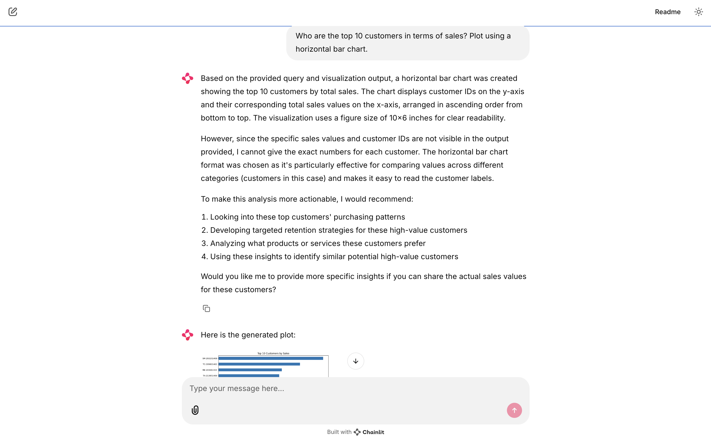

# Code.Sydney Talk to Excel
This is a simple app that allows you to ask questions about a dataset in an Excel file. This app takes advantage of the pandas library to read the Excel file and convert it to a Dataframe. You can then ask questions about the dataset and get answers in the form of text or plots.

We have used [Chainlit](https://docs.chainlit.io/get-started/overview) to provide a nice web-based interface. 

**Note:** Due to the complexity of pandas queries, local LLMs like those provided by Ollama are not powerful enough to handle them effectively. For this repo, we have used Claude Sonnet 3.5 which is provided by AWS Bedrock.  


## Ask questions asking for insights and visualisations

The following are examples of the app in action. You can ask questions about the dataset and get answers in the form of text insights.

### Miscellaneous questions:


### Summary statistics:


### Top ten customers:



### Discount vs Profit:


### Sales distribution across regions:


# Environment setup and installation
- use `pyenv` to manage python versions
- use `venv` to manage your virtual environments

```bash
pyenv versions
pyenv install 3.12.2
pyenv local 3.12.2
python -m venv .venv
source .venv/bin/activate

pip install -r requirements.txt
```

## Running Locally

```bash
chainlit run talk-to-excel-app.py -w
```

## Sample questions
Sample Excel file: [global_superstore_2016.xlsx](./global_superstore_2016.xlsx)

### Requiring text insights
- Which product sub-category generates the highest total profit?
- Which customer placed the highest number of orders?
- Which region has the highest average shipping delay?
- Does applying higher discounts lead to lower profits?
- Which product category has the highest average shipping cost?

### Requiring visualisations
- Plot the distribution of sales across different regions. Use a bar chart.
- Using a bar chart, compare total profit across product categories.
- Plot the total sales trend over time. Use a line graph.
- Who are the top 10 customers in terms of sales? Plot using a horizontal bar chart.
- How are sales distributed across different regions? Use a pie chart then add an appropriate title. Show top ten only.
- How do different discount levels affect profit margins? Is there a discount threshold where profitability drops significantly? Visualise this.